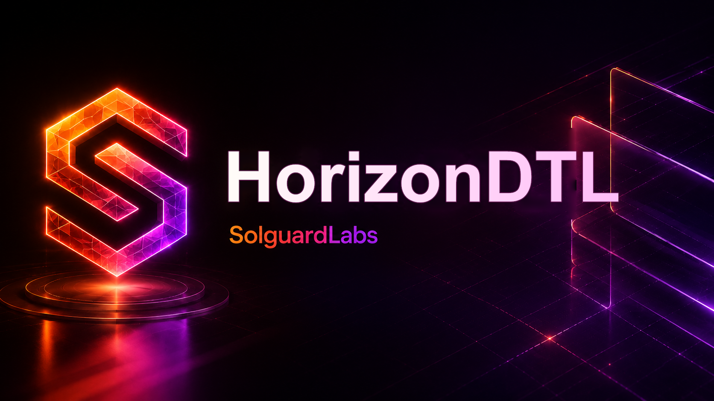

# Horizon DTL



Horizon DTL es una libreria Rust para modelar liquidacion distribuida mediante
vaults, notas de entrega, tickets de redencion y rutas de settlement. El crate
esta disenado como nucleo de protocolo: no expone un binario y se consume desde
tests, integraciones o aplicaciones externas mediante `src/lib.rs`.

El objetivo principal es ofrecer una superficie de ledger realista con
identidades firmadas, control de roles, observaciones de indice, gestion de
fees, limites de riesgo y journal canonico.

## Componentes Principales

- `amount`: importes, basis points, unidades de participacion e indices.
- `asset`: configuracion de activos liquidables.
- `codec`: serializacion canonica para digests y firmas.
- `crypto`: identidades publicas y firmas Ed25519.
- `fees`: programacion y acumulacion de fees de protocolo.
- `ids`: identificadores derivados para cuentas, activos, vaults, notas,
  tickets y transacciones.
- `ledger`: estado principal, cuentas, journal y transiciones economicas.
- `notes`: ordenes de ingreso y notas de entrega.
- `operators`: roles operativos y configuracion del protocolo.
- `oracle`: observaciones de indice por vault.
- `risk`: limites y snapshots de riesgo por ticket.
- `routes`: rutas autorizadas entre vaults.
- `tickets`: tickets firmados de redencion.
- `vault`: configuracion y estado de liquidez.

## Flujo de Operacion

Un flujo tipico sigue esta secuencia:

1. Registrar activos y cuentas.
2. Configurar protocolo, roles y limites de riesgo.
3. Registrar vaults y rutas de liquidacion.
4. Publicar observaciones de indice para los vaults.
5. Depositar liquidez en vaults.
6. Emitir una `DeliveryNote` mediante `SignedIngressOrder`.
7. Liquidar la nota mediante `SignedRedemptionTicket`.
8. Auditar el journal y verificar conservacion por activo.

Todas las transiciones economicas relevantes generan una entrada de journal con
digest de estado.

## Uso Como Libreria

Ejemplo basico de importacion:

```rust
use horizon_dtl::{
    Amount, AssetConfig, Bps, HorizonLedger, KeyPair, RiskLimits,
};

let mut ledger = HorizonLedger::new(72_901);
let asset = AssetConfig::new("HUSD", 6, Bps::new(80)?)?;
ledger.register_asset(asset)?;
ledger.set_risk_limits(RiskLimits::new(
    500,
    Amount::new(50_000_000_000)?,
    Bps::new(100)?,
    Amount::zero(),
)?);
# Ok::<(), horizon_dtl::HorizonError>(())
```

## Desarrollo

Requisitos:

- Rust `1.96` o superior compatible con edicion 2024.
- Bun `1.3` o superior.

Instalar dependencias JavaScript:

```bash
bun install --frozen-lockfile
```

Comandos principales:

```bash
bun run build
bun run check
bun run test:rust
bun run test:node
bun run test:all
bun run ci
```

## Pruebas

La suite Rust esta en `tests/horizon_flow.rs` y valida escenarios de ledger:

- inicializacion operativa;
- emision de notas;
- liquidacion local;
- liquidacion enrutada;
- actualizacion de indices;
- rechazo de tickets no validos.

La suite JavaScript esta en `tests/node` y usa Bun para ejecutar validaciones
externas sobre Cargo, metadata del crate y estructura de la libreria.

## CI

El workflow de GitHub Actions ejecuta:

- `bun install --frozen-lockfile`
- `bun run fmt:check`
- `cargo fmt --all -- --check`
- `cargo clippy --all-targets --all-features --locked -- -D warnings`
- `cargo build --all-targets --locked`
- `cargo test --locked`
- `bun run test:node`

Dependabot revisa semanalmente dependencias de Cargo, Bun y GitHub Actions.

## Reproducibilidad

`Cargo.lock` y `bun.lock` se versionan para fijar dependencias. Los directorios
`target/` y `node_modules/` estan excluidos del repositorio.
